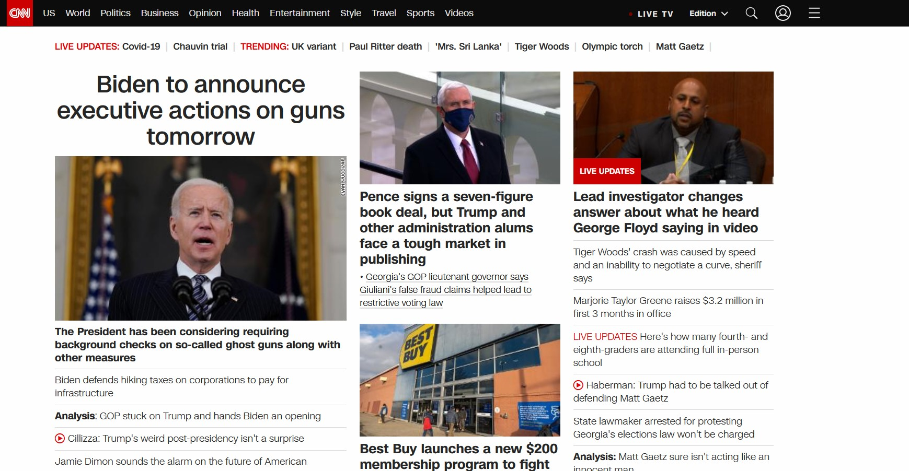

# DH 110 Assignment 1: Heuristic Evaluation
## By Adam Kaba

Severity will be rated by the following criteria:
-------------------------------------------------
1 = Cosmetic problem only: need not be fixed unless extra time is available on project  
2 = Minor usability problem: fixing this should be given low priority  
3 = Major usability problem: important to fix, so should be given high priority

Given by: https://www.nngroup.com/articles/how-to-rate-the-severity-of-usability-problems/

### Website 1: [Delish](https://www.delish.com/)

*Delish is a website to go too for all things food. On the website things such as news, trends, popular restaurants, cooking tips, and even products to buy. Many people come to this site in order to find a recipe or maybe get inspiration.*

https://www.delish.com/

**Evaluation**:

*The delish webpage isnt awful, however some very weird design choices hold it back from being intuitive and clean like the rest of its competitors. For example the image of the main page looks like the bottom was cut off, its not, thats exactly how the page appears on the computer. The website is confusing to navigate for a first time user, and once you figure out how to navigate it, it's still difficult to find what you're looking for.*

|Heuristic & Meaning| Heuristic Evaluation | Recommendation| Severity Rating|
|-------------------|----------------------|---------------|----------------|
| **Visibility of System Status**: The system should always give you an indication of what is going on once you perform an action |The system does a good job letting you know an option is selected, however it's not exactly clear what on the screen is an option to choose from. | The website whould have clickable items in a different color, or have them stand out somehow |2|
| **Match between system & real world**: The system should follow intuition from real life conventions. This includes using familliar words and making the system flow logically. |The system does a good job following real life conventions, however some of the lingo used might be a bit too colloquial for non young adults to understand. Maybe intentional to cater to audience | The website should tone down the wording used, depending on who the catered audience is |1|
| **User control & freedom**: The user should be allowed to navigate the interface freely and be in control. The user should not get locked into certain actions and become stuck.| From the main page, the interface is somewhat hard to navigate. Once you figure out where to go, you don't have much control over what you're shown. |The website should include filters to pick and choose what you are looking at in a selection of items. Search bars should also be impelented on pages such as recipes|3|
| **Consistency & standards**: The system should function as the user expects based on their experiences with other systems. The system should follow intuitive conventions used by other systems |The system functions very differently than one would expect from a simillar system. The main page is a giant picture with the menu bar at the bottom-left. The search bar and any options are hidden until you click the menu button.|The search bar should be implemented on the main page for ease of access. The menu should also be at one of the top corners from the start, rather than when you slow down. |3|
| **Recognition rather than recall**: The user should not have to struggle to remember what elements and actions do. They should be able to easily recognize and recall info on screen.|Due to the websites different design choices, navigating the website requires users to learn it's specific layout, rather than being able to understand what their looking at.|The website should make the users options, such as what they can click, more clear. Along with this it would be beneficial to standardize the layout|2|
| **Error Prevention**: Aside from error troubleshooting, the system should prevent errors from occuring due to user actions in the first place.  | The website does a good job at preventing errors |None needed| 1 |
| **Flexibility and efficiency of use**: Shortcuts, or simillar methods should be implemented such that experienced users can speed up interactions. These methods should be hidden from beginner users so the system works well for new users as well as experienced users.|The only method of a shortcut present on the website is a search bar.|While not super important as, people aren't using a website to conduct a task itself, adding tags and filters to recipies and items such as(*Breakfast*, *meat*, *vegetarian*) would speed up user interactions significantly. |2|
| **Aesthetic and minimalist design**: The interface should not have elements distracting users from the important/ relevant information. The pertinent info should be displayed prominently and should not have to compete with other elements for attention.  |The website is very minimalist and the aesthetic is nice, however the pertinent info is not displayed prominently. All food items are jumbled together and not really grouped at all. The display shows a changing amount of columns, so navigating the recipe section feels weird. Furthermore the menu options could be combined to be more concise.|The different information should be listed under categories and separated. Having something like a michelada next to a stir-fry reciple, jumbles the information presented up. There's no need for three shop options in the menu when it's the same shop but different product, they should be combined into one option to be concise. The images also shouldn't be 50x bigger than the text. |3|
| **Help users with errors**: Error messages should be explained in common language, they should state the problem and offer solutions to fix it. There shouldnt be any code or hexadecimal error numbers. |The error messages are explained clearly from my experience. |None needed |1|
| **Help and documentation**: The system shouldn't need extra explainations, however if it does, help and proper steps for the user to take in order to complete a task should be clearly documented and listed. The list should be concise and the user should be able to follow instructions step by step and arrive at their intended result.|There is no clear way to get to a help section. If you type help into the search bar, you are given every article with the word help contained in it, not helpful at all. |The website should add a help/assistance section at the bottom of the menu|3|

### Website 2: [CNN](https://www.cnn.com/)
*CNN is a household name, they cover news from all different sectors of life, from locations all across the world. The site contains information on politics, health, travel, sports, and more. People come to this site to get updates on all the latest news.*

https://www.cnn.com/

*While not super far behind it's competitors, CNN's website is not the most easily navigated website. From the main page you are shown an exuberant amount of information, with no clear way to filter out what you want besides the extremely broad sections at the top. The site could be very easily improved to streamline navigation for users*

|Heuristic & Meaning| Heuristic Evaluation | Recommendation| Severity Rating|
|-------------------|----------------------|---------------|----------------|
| **Visibility of System Status**: The system should always give you an indication of what is going on once you perform an action |The website gives you a good idea of whats happening, such as lighting up when you hover over an option. However much of the information looks static, so it's hard to tell what options are. | Possible user selections should stand out a bit more |2|
| **Match between system & real world**: The system should follow intuition from real life conventions. This includes using familliar words and making the system flow logically. | The system does a good job using conventions from real life. | None really needed |1|
| **User control & freedom**: The user should be allowed to navigate the interface freely and be in control. The user should not get locked into certain actions and become stuck.| The user has a lot of freedom to roam around the many different categories, however not much control over what they are being shown. The search bar is the only way to filter information thats not predetermined by cnn to show you.| Filters should exist in order for users to control what types of information they want to see, rather than just being able to choose from a few options on the main page|3|
| **Consistency & standards**: The system should function as the user expects based on their experiences with other systems. The system should follow intuitive conventions used by other systems |The system follows conventions from other user products to a bare minimum. Items on the page appear where they are supposed too with the exception of categories and live updates, however they function differently.|The position on the screen of live updates and news categories should be swapped. The menu and search bar should be more prominent and noticeable on the screen. Opening the menu bar should not cover the whole screen in information. |3|
| **Recognition rather than recall**: The user should not have to struggle to remember what elements and actions do. They should be able to easily recognize and recall info on screen.|Due to the websites different layout, users need to learn the websites specific way of navigation, rather than recognizing familliar options |The layout should be standardized, and possibile options should be displayed more clearly to reduce ambiguity.|2|
| **Error Prevention**: Aside from error troubleshooting, the system should prevent errors from occuring due to user actions in the first place.  | The system does a good job at preventing errors |None needed|1|
| **Flexibility and efficiency of use**: Shortcuts, or simillar methods should be implemented such that experienced users can speed up interactions. These methods should be hidden from beginner users so the system works well for new users as well as experienced users.|No shortcuts exist besides the search bar. |Shortcuts such as filters should be implemented in order for knowledgeable users who have a general idea of what they're looking for to speed up their interactions.|3|
| **Aesthetic and minimalist design**: The interface should not have elements distracting users from the important/ relevant information. The pertinent info should be displayed prominently and should not have to compete with other elements for attention.  |The interface is very cluttered and basic. The text on the screen blends together and is overwhelming, the pictures are also in a weird layout, making the aesthetic *unpleasing* so to speak. |The interface should be cleaned up via a side bar. There should be one main idea shown on the screen at a time, and maybe change the topic via a slideshow in the middle| 3 |
| **Help users with errors**: Error messages should be explained in common language, they should state the problem and offer solutions to fix it. There shouldnt be any code or hexadecimal error numbers. |Error messages do a good job explaining what went wrong.|None needed |1|
| **Help and documentation**: The system shouldn't need extra explainations, however if it does, help and proper steps for the user to take in order to complete a task should be clearly documented and listed. The list should be concise and the user should be able to follow instructions step by step and arrive at their intended result.|There is a help section, however it is convoluted to get too. |The help section should be more easily noticeable, perhaps given a "Support" section under the menu bar. This would allow users to more easily access helpful resources.|2|

